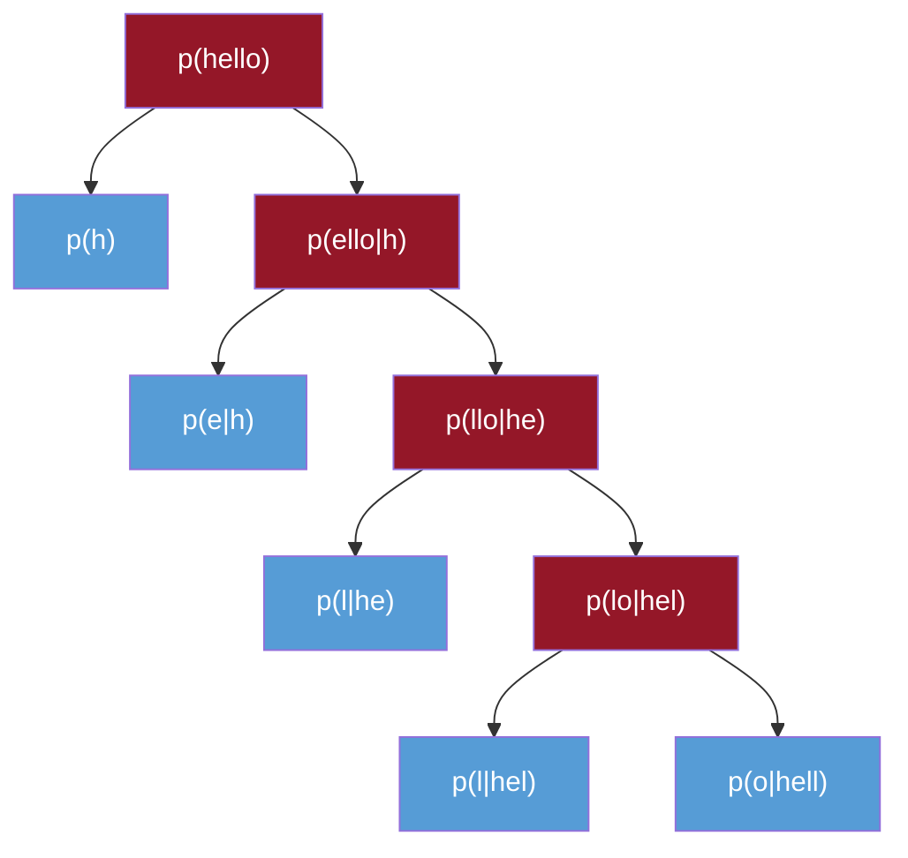

# N-Gram Language Models
## Generating Text Without Neural Networks!

**Goal:** Build a simple text generator using just probability and counting

**No training GPUs needed** - just count character frequencies

---
layout: default
---

## What is an N-Gram?

**N-gram:** Sequence of N consecutive items (characters, words, tokens)

**Examples with "hello␣world":**
- **1-gram (unigram):** `h`, `e`, `l`, `l`, `o`, `␣`, `w`, `o`, `r`, `l`, `d`
- **2-gram (bigram):** `he`, `el`, `ll`, `lo`, `o␣`, `␣w`, `wo`, `or`, `rl`, `ld`
- **3-gram (trigram):** `hel`, `ell`, `llo`, `lo␣`, `o␣w`, `␣wo`, `wor`, `orl`, `rld`
## N-Grams for Text Generation

**Idea:** Use previous N-1 characters to predict next character

<div class="grid grid-cols-2 gap-4">
<div>

**N-grams from a large corpus (including "hello"):**

| n-gram | count |
|--------|-------|
| ^^h    | 30    |
| ^he    | 10    |
| hel    | 5     |
| ...    | ...   |

</div>
<div>

**Current state:**
```
Generated: ^^
```

</div>
</div>

---

## Generation Step 1

<div class="grid grid-cols-2 gap-4">
<div>

**Trigrams starting with "^^":**

| n-gram | count |
|--------|-------|
| ^^h    | 30    |
| ^^w    | 10    |
| ^^j    | 10    |
| ...    | ...   |

**Total: 50**

</div>
<div>

**Generated so far:** `^^`  
**Current context:** `^^`

**Probabilities:**
```
h  ████████████  30/50
w  ████          10/50
j  ████          10/50
```

**Selected: h**

</div>
</div>

---

## Generation Step 2

<div class="grid grid-cols-2 gap-4">
<div>

**Trigrams starting with "^h":**

| n-gram | count |
|--------|-------|
| ^he    | 10    |
| ^ho    | 8     |
| ^ha    | 5     |
| ^hi    | 5     |
| ...    | ...   |

**Total: 28**

</div>
<div>

**Generated so far:** `^^h`  
**Current context:** `^h`

**Probabilities:**
```
e  ██████████  10/28
o  ████████    8/28
a  █████       5/28
i  █████       5/28
```

**Selected: e**

</div>
</div>

---

## Generation Step 3

<div class="grid grid-cols-2 gap-4">
<div>

**Trigrams starting with "he":**

| n-gram | count |
|--------|-------|
| hel    | 5     |
| her    | 3     |
| hey    | 2     |
| ...    | ...   |

**Total: 10**

</div>
<div>

**Generated so far:** `^^he`  
**Current context:** `he`

**Probabilities:**
```
l  ██████████  5/10
r  ██████      3/10
y  ████        2/10
```

**Selected: l**

</div>
</div>

---

## Generation Step 4

<div class="grid grid-cols-2 gap-4">
<div>

**Trigrams starting with "el":**

| n-gram | count |
|--------|-------|
| ell    | 25    |
| els    | 8     |
| ele    | 5     |
| ...    | ...   |

**Total: 38**

</div>
<div>

**Generated so far:** `^^hel`  
**Current context:** `el`

**Probabilities:**
```
l  ████████████████  25/38
s  ████████          8/38
e  █████             5/38
```

**Selected: l**

</div>
</div>

---

## Generation Step 5

<div class="grid grid-cols-2 gap-4">
<div>

**Trigrams starting with "ll":**

| n-gram | count |
|--------|-------|
| llo    | 15    |
| lly    | 12    |
| lle    | 8     |
| ...    | ...   |

**Total: 35**

</div>
<div>

**Generated so far:** `^^hell`  
**Current context:** `ll`

**Probabilities:**
```
o  ██████████████  15/35
y  ████████████    12/35
e  ████████        8/35
```

**Selected: o**

**Final result:** `^^hello`

</div>
</div>

---

## Why Does This Work?

**We just generated text by counting!**
 But why does this actually work?

**The Theory:**

<v-clicks>

- **Autoregressive:** Output at each step depends on the model's own previous outputs
- Every generative model needs $P(\text{next} | \text{context})$
- Understanding N-gram math = understanding **all** language models
- Same probability foundations power both simple and complex models

</v-clicks>

---

## Probability: Joint vs Conditional

Let's put this into the context of generative modeling.  
We are learning a model for $p(\text{sequence})$. 

**Goal:** Model probability of entire sequence

**Example:** $p(\text{hello}) = p(h, e, l, l, o)$

---

## Chain Rule - Step by Step

**Chain rule** factorizes joint into conditionals:

<div v-click>

$$p(\text{hello}) = \underbrace{p(h)}_{\text{easy!}} \cdot p(\text{ello}|h)$$

</div>

<div v-click>

$$p(\text{hello}) = p(h) \cdot p(e|h) \cdot p(\text{llo}|\text{he})$$

</div>

<div v-click>

$$p(\text{hello}) = p(h) \cdot p(e|h) \cdot p(l|\text{he}) \cdot p(\text{lo}|\text{hel})$$

</div>

<div v-click>

$$p(\text{hello}) = p(h) \cdot p(e|h) \cdot p(l|\text{he}) \cdot p(l|\text{hel}) \cdot p(o|\text{hell})$$

</div>

---

## Chain Rule Visualization



---

## General Pattern

$$p(x_1,\ldots,x_n) = p(x_1) \cdot p(x_2|x_1) \cdot p(x_3|x_1,x_2) \cdot p(x_n|x_1,\ldots,x_{n-1})$$

**Problem:** $p(x_n|x_1,\ldots,x_{n-1})$ needs **entire history**

<v-clicks>

- For long sequences: too many possible histories!
- As context gets longer, harder to find enough matches in training data

</v-clicks>

---

## Markov Assumption

**Key idea:** Assume each character depends only on **last k characters**

$$p(x_n|x_1,\ldots,x_{n-1}) \approx p(x_n|x_{n-k},\ldots,x_{n-1})$$

---

## Markov Assumption (continued)

**Order-k Markov assumption:**

<v-clicks>

- Ignore history beyond k positions
- Only use k previous characters as context

</v-clicks>

**Example with k=2:**
$$p(\text{hello}) = p(h) \cdot p(e|h) \cdot p(l|\text{he}) \cdot p(l|\text{el}) \cdot p(o|\text{ll})$$

---

## Markov Trade-offs

**Trade-off:**

<v-clicks>

- **Smaller k:** Less context, simpler patterns, more general
- **Larger k:** More context, complex patterns, needs more data

</v-clicks>

| ORDER | Context | Pattern Quality | Data Needs |
|-------|---------|----------------|------------|
| 2     | 2 chars | Generic        | Low        |
| 8     | 8 chars | Balanced       | Medium     |
| 20    | 20 chars| Highly specific| Very High  |

---

## Training: Count N-Grams

**Step 1:** Fetch corpus (Shakespeare plays)

```python
from urllib.request import urlopen

url = "https://raw.githubusercontent.com/karpathy/char-rnn/\
master/data/tinyshakespeare/input.txt"
with urlopen(url) as r:
    corpus = r.read().decode('utf-8')
```

**Step 2:** Define parameters

```python
ORDER = 8   # context length (8-char context → 9-gram)
PAD = "^"   # padding at start
END = "$"   # end marker
```

---

## Training: Counting Loop

**Step 3:** Count frequencies

```python
count = {}  # count[context] = {next_char: frequency}

for block in blocks:
    seq = PAD * ORDER + block + END  # pad start, mark end
    
    for i in range(len(seq) - ORDER):
        ctx = seq[i:i+ORDER]          # 8 characters
        next_char = seq[i+ORDER]       # 1 character
        
        if ctx not in count:
            count[ctx] = {}
        count[ctx][next_char] = count[ctx].get(next_char, 0) + 1
```

---

## Training Example

**Example:**
- Sequence: `"^^^^^^^^To be or"`
- `i=8`: `ctx="^^^^^^^^"` → `next_char="T"`
- `i=9`: `ctx="^^^^^^^T"` → `next_char="o"`
- `i=10`: `ctx="^^^^^^To"` → `next_char=" "`

**Visual:**
```
^^^^^^^^To be or
^^^^^^^^ → T
 ^^^^^^^T → o
  ^^^^^^To →  
   ^^^^^To  → b
```

---

## Training: Save Model

**Step 4:** Save counts

```python
import json

with open("ngram_counts.json", "w") as f:
    json.dump(count, f)
```

**Result:** Dictionary mapping contexts to character frequencies
```json
{
  "To be or": {"n": 42, " ": 15, "d": 3},
  "be or no": {"t": 87},
  ...
}
```

**Key insight:** We've estimated $p(\text{next\_char} | \text{context})$ by **counting!**

---

## Prediction: Load and Initialize

**Step 1:** Load counts

```python
with open("ngram_counts.json") as f:
    count = json.load(f)
```

**Step 2:** Start with padding

```python
import numpy as np

rng = np.random.default_rng()
gen = PAD * ORDER  # "^^^^^^^^"
```

---

## Prediction: Generation Loop

**Step 3:** Generate one character at a time

```python
for _ in range(MAX_LEN):
    ctx = gen[-ORDER:]              # last 8 characters
    ctx_counts = count.get(ctx, {}) # get observed frequencies
    
    if not ctx_counts:              # unseen context
        break
    
    # Convert counts to probabilities and sample
    chars = list(ctx_counts.keys())
    probs = np.array([ctx_counts[c] for c in chars])
    probs = probs / probs.sum()     # normalize
    
    next_char = rng.choice(chars, p=probs)
    gen += next_char
    
    if next_char == END:
        break
```

---

## Sampling Strategy

**Key:** Sample proportional to observed frequencies

If "e" followed "To be or" 42 times, "n" 15 times:

$$P(\text{next} = \text{``e''} | \text{``To be or''}) = \frac{42}{42+15+3} = 0.70$$
$$P(\text{next} = \text{``n''} | \text{``To be or''}) = \frac{15}{42+15+3} = 0.25$$
$$P(\text{next} = \text{``d''} | \text{``To be or''}) = \frac{3}{42+15+3} = 0.05$$

---

## Prediction: Output

**Step 4:** Clean up output

```python
# Strip padding and end marker
output = gen[ORDER:].replace(END, "")
print(output)
```

**Example outputs:**
```
ROMEO:
O, that I were a glove upon that hand,
That I might touch that cheek!

NURSE:
What say you? can you love the gentleman?
```

**Surprisingly coherent** for such a simple model!

---

## Live Demo

Open terminal and run:
```bash
cd mathematical_foundations/07_ngram
python 07_ngram_train.py    # count N-grams
python 07_ngram_predict.py  # generate text
```

---

## Extensions and Experiments

**Try different sources:**
- **Pride and Prejudice:** Classic prose style
- **Alice in Wonderland:** Whimsical narrative
- **Django code:** Python syntax patterns
- Mix sources? Compare outputs?

---

## Characters vs Tokens

<div class="grid grid-cols-2 gap-4">
<div>

**Current: Character-level**
- Fine-grained
- Needs less data
- Vocab ≈ 100 characters

</div>
<div>

**Alternative: Token-level**
```python
import tiktoken
enc = tiktoken.get_encoding(
    "cl100k_base"
)
tokens = enc.encode(text)
# Use tokens as keys
```
- Vocab ≈ 50,000 tokens
- Needs more data
- Better semantic units

</div>
</div>

---

## Varying ORDER Parameter

| ORDER | Pattern Type | Use Case |
|-------|-------------|----------|
| 2 | Simple, generic | Fast generation, minimal data |
| 8 | **Balanced** | **Current setting** |
| 20 | Very specific, Shakespeare-like | Huge corpus needed |

**Exponential growth:** `vocab^ORDER` possible contexts

---

## Summary

**N-gram models:**

<v-clicks>

1. **Chain rule:** Factorize $p(x_1,\ldots,x_n)$ into conditional probabilities
2. **Markov assumption:** Each position depends only on last k items
3. **Training:** Count frequencies of N-grams in corpus
4. **Prediction:** Sample next item proportional to observed frequencies

</v-clicks>

---

## Key Insights

**Main idea:**

<v-clicks>

- Estimate conditional probabilities **by counting**
- No gradient descent, no GPUs - just frequencies!

</v-clicks>

**Limitations:**

<v-clicks>

- Fixed context window (can't see beyond ORDER characters)
- Exponential growth: $\text{vocab}^{\text{ORDER}}$ possible contexts
- No semantic understanding

</v-clicks>

**Next step:** Neural language models (transformers) solve these issues!

---

## Mathematical Foundation

The complete generative process:

$$P(\text{sequence}) = \prod_{i=1}^{n} P(x_i | x_{i-k}, \ldots, x_{i-1})$$

where $k$ is the ORDER parameter.

**Estimation from data:**
$$\hat{P}(x_i | \text{context}) = \frac{\text{count}(\text{context}, x_i)}{\sum_{x'} \text{count}(\text{context}, x')}$$

---

# Questions?

**Try it yourself:**
```bash
cd mathematical_foundations/07_ngram
python 07_ngram_train.py
python 07_ngram_predict.py
```

**Experiment with:**
- Different text sources
- Different ORDER values
- Character vs token-level models
