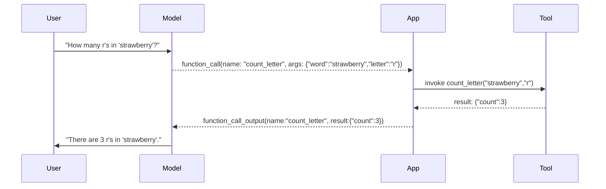

# Function calling (concepts)

## Introduction and motivation
Language models can "call" external functions by emitting a structured function-call request rather than running code themselves. This page explains the core ideas you need to understand how function calling (a.k.a. tool use) works with modern LLM APIs and how it differs from structured output.

What you will learn:
- How an LLM asks for a function call (name, description, parameters/schema).
- The developer's responsibility to implement, run, and return results.
- How function calling is similar to and different from structured output.
- A simple sequence diagram showing the round trip.

Why it matters:
Tool use lets models request precise operations (e.g., counting letters, querying a DB, running a search) while keeping the ground-truth work inside your code.

---

## Core idea
An LLM does not execute your code. Instead:
1. The system provides the model with a list of available tools (each with a name, description, and parameter specification — typically a JSON schema).
2. The model decides whether a tool is useful for answering the user's query.
3. If so, the model emits a structured "function call" containing the chosen tool name and a JSON object of arguments.
4. Your application receives that request, runs the actual function/tool, and returns the function's result back to the model as a special function output item.
5. The model then composes a final answer using the returned result.

Key point: the model only *requests* the call; your runtime actually executes it and controls side effects, permissions, and data access.

---

## Sequence diagram (Mermaid)



Fallback: if Canvas does not render Mermaid, the same flow is described in the paragraph above and visually in the opening figure of the course overview.

---

## How this relates to structured output
- Structured output requires the model to produce its final answer in a pre-defined schema.
- Function calling is a mid-conversation request: the model asks for missing information or computation (the function result) before producing the final answer.
- Both require adjacent specifications (schemas), but function calling also needs a name and a human-friendly description so the model can *choose* the right tool.

---

## Tool definition checklist (what to provide for each tool)
- name: stable, short identifier (e.g., `count_letter`).
- description: one or two sentences describing what the tool does and when to use it.
- parameters: JSON Schema describing accepted arguments and types (required vs optional).
- safety notes: side effects, privacy concerns, rate limits, or permission requirements.

Example (informal):
```
name: "count_letter"
description: "Count occurrences of a single character in a word. Use for exact character-counting tasks."
parameters:
  type: object
  properties:
    word: {type: string}
    letter: {type: string, minLength:1, maxLength:1}
  required: ["word","letter"]
```

---

## Developer responsibilities
- Supply clear tool metadata (name, description, parameters).
- Implement the function to run in your runtime and validate arguments.
- Execute the function safely (check permissions, sanitize inputs, enforce rate limits).
- Return the result to the model in the API's expected function-response field.
- Log calls for auditing and debugging.

---

## Pedagogy note and overlap with prior material
This topic intentionally echoes the structured-output lesson from the previous module because the same idea — "adjacent specification" of valid structured data — is the underlying pattern. Before proceeding with advanced examples (RAG, agent loops, multi-tool orchestration), review the structured-output page/module if it is unfamiliar.

Suggested quick review link: ../prompt_engineering_api/06_structured_output/ (Demo 6: Structured output) and Module 2 notes.

---

## Where the demos fit
The code demos in this folder (01a, 01b, 01c) demonstrate three implementation styles:
- 01a: hand-typed JSON schema + raw parsing
- 01b: Pydantic model → schema + validated parsing
- 01c: OpenAI Agents SDK with automatic schema + dispatch

These demos are optional; the conceptual page above is the recommended reading before running them. The demos are implementations of the pattern described here, not the conceptual explanation itself.

---

## Additional resources
- OpenAI: Function calling guide — https://platform.openai.com/docs/guides/function-calling
- OpenAI: Tools and Responses API docs — https://platform.openai.com/docs/guides/tools
- OpenAI Agents SDK — https://openai.github.io/openai-agents-python/

---

## Accessibility and Canvas notes
- If embedding Mermaid diagrams, provide the textual sequence as fallback.
- Replace iframe embeds with code excerpts if Canvas blocks external iframes.


---

If this content looks right, next actions can be:
- Replace the HTML Canvas page with this Markdown-rendered page (recommended).
- Or update the existing HTML page to match this content and ensure images/mermaid fallbacks use GitHub raw URLs.

Which should be done next? (Use the Canvas upload skill when ready.)
